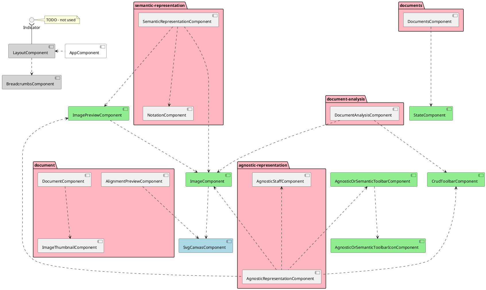

#MuRET technical documentation

## Angular
The following structure has been used inside the `app` module:

* auth
    + LoginComponent
    + ResetPasswordComponent
* core
* features
    + about
      * AboutComponent
    + admin-dashboard
      * AdminDashboadComponent
      * PermissionComponent
      * RegisterComponent
      * RegisterModelComponent
    + agnostic-representation
      * AgnosticRepresentationComponent
      * AgnosticStaffComponent
      * AgnosticToolbarComponent
      * AgnosticToolbarIconComponent
      * ImagePreviewComponent
    + document
      * AlignmentPreviewComponent
      * DocumentComponent
      * DocumentScoreViewerAndExporterComponent
      * ImageThumbnailComponent
      * InstrumentsComponent
      * MeiScoreViewerComponent
      * UploadImagesComponent
    + document-analysis
      * DocumentAnalysisComponent
      * ImageComponent
    + documents
      * CollectionsComponent
      * DocumentsComponent
    + export
        * TrainingSetsComponent
    + home
        * HomeComponent
    + new-document
        * NewDocumentComponent
    + parts
        * PartSelectionComponent
    + semantic-representation
        * NotationComponent
        * SemanticRepresentationComponent
* layout
  + LayoutComponent
  + BreadcrumbsComponent
* shared
    + CrudToolBarComponent
    + StateComponent
    + AgnosticOrSemanticToolBarComponent
* dialogs
    * ConfirmDialogComponent
    * ConfirmDialogWarningComponent
    * ErrorModalMessageComponent
    * InputDialogComponent
    * LinksModalDialogComponent
    * OptionsDialogComponent
* svg
    + LineComponent
    + PolylinesComponent
    + RectangleComponent
    + ShapeComponent
    + SvgCanvasComponent
    + TextComponent
    
In the following diagrams, only dependencies are represented. In order to easily layout
the diagram, packages are not drawn but replaced for the following colors:
* `SVG`: blue  
* `shared`: green
* `features`: pink
* `layout`: gray

## Spring
