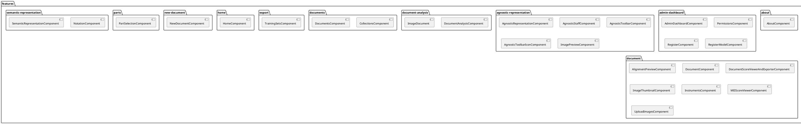

#MuRET technical documentation

## Angular

```puml
@startuml
package "auth" {
    [LoginComponent]
    [ResetPasswordComponent]
}

package "breadcrumb" {
    [BreadcrumbComponent]
}

package "core" {
}

package "features" {
    package "about" {
        [AboutComponent]
    }
    package "admin-dashboard" {
        [AdminDashboardComponent]
        [PermissionsComponent]
        [RegisterComponent]
        [RegisterModelComponent]
    }
    package "agnostic-representation" {
        [AgnosticRepresentationComponent]
        [AgnosticStaffComponent]
        [AgnosticToolbarComponent]
        [AgnosticToolbarIconComponent]
        [ImagePreviewComponent]
    }    
    package "document" {
        [AlignmentPreviewComponent]
        [DocumentComponent]
        [DocumentScoreViewerAndExporterComponent]
        [ImageThumbnailComponent]
        [InstrumentsComponent]
        [MEIScoreViewerComponent]
        [UploadImagesComponent]
    }       
    package "document-analysis" {
        [DocumentAnalysisComponent]
        [ImageDocument]
    }         
    package "documents" {
        [CollectionsComponent]
        [DocumentsComponent]
    }     
    package "export" {
        [TrainingSetsComponent]
    }      
    package "home" {
        [HomeComponent]
    }       
    package "new-document" {
        [NewDocumentComponent]
    }    
    package "parts" {
        [PartSelectionComponent]
    }  
    package "semantic-representation" {
        [NotationComponent]
        [SemanticRepresentationComponent]
    }                               
}

package "Layout" {
    [LayoutComponent]
}

package "Shared" {
 [ConfirmDialogComponent]
 [ConfirmDialogWarningComponent]
 [CrudToolbarComponent]
 [AlertComponent]
 [InputDialogComponent]
 [LinksModalDialogComponent]
 [OptionsDialogComponent]
 [StateComponent]
 [ToolbarComponent]
}

package "SVG" {
    [LineComponent]
    [PolylinesComponent]
    [RectangleComponent]
    [ShapeComponent]
    [SvgCanvasComponent]
    [TextComponent]
}


@enduml
```

## Spring
