# MuRET technical documentation
The front end has been developed using **Angular** with **Redux**. The following diagrams depict the interaction between components and [how the *ngrx store* is managed](../angular/redux.md).

Notes on naming style:
* selectors names should be prefixed with the name of the store (e.g. `selectAuthIsAuthenticated` rather than `selectIsAuthenticated`).
* the same principle is applied to public actions: `AuthLogIn` instead of `LogIn`. Actions used internally by the effects can omit this prefix.

## Model
The following class diagram contains the whole hierarchy, however it's not always fully populated, it depends on the different actions in individual modules.

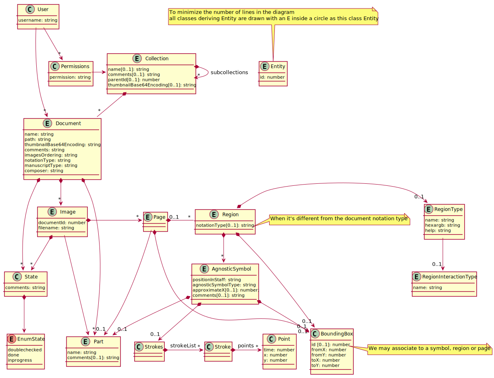

## Routing and permissions
The routing mechanism has been used. All elements are grouped into components, each one with its own routing.
Guards are used to prevent unauthorized users from entering restricted pages.

## Main AppComponent
The main angular component just takes care of notifying the store when the page has been refreshed to reload session data as a means of not loosing the state of the application.
Everything else is delegated to the `LayoutComponent`.

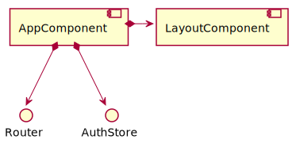
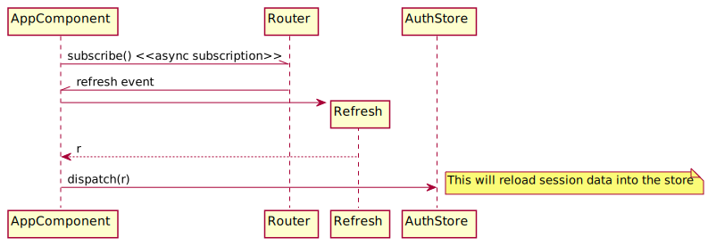

## Auth store

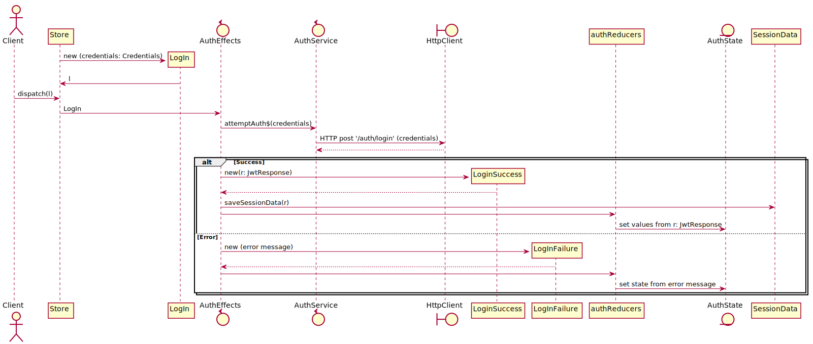

**Hereafter, rather than using sequence diagrams, the following information wil be used to summarize the Redux tuples.**

| **Action** | **`AuthService` method** | **API Rest method** | **`AuthState` properties on succes** | **Properties on failure** | 
| --- | ----------- | ----------- | ----------- | ----- | 
| `AuthLogIn(c: Credentials)` | `attemptAuth$(c: Credentials)` | `/auth/login` | `isAuthenticated`, `accessToken`, `userID`,  `username`, `roles`, reset `errorMessage`.   It sets `SessionData` with these data| `errorMessage`| 
| `AuthLogOut()` |  |  | Clears `SessionData` | |  
| `AuthGetStatus()` |  |  |  | 
| `AuthRefresh()`: it invokes `RefreshLogged` |  |  |  | 
| `AuthRefreshLogged(s: SessionData)` |  | `isAuthenticated`, `accessToken`, `userID`,  `username`, `roles` are set from `SessionData` if present |  | 
| `AuthResetPassword(r: ResetPWD)` | `resetPassword$(r: ResetPWD)` | `/users/resetpwd` | `passwordresetmess=0` | `passwordresetmess=1` |
|  |  |  |  |  | 

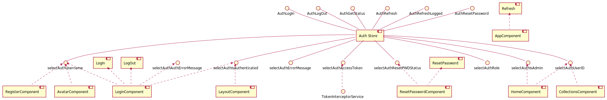

## Core store
This *Redux* class contains information used along the whole application: user, status and fonts.

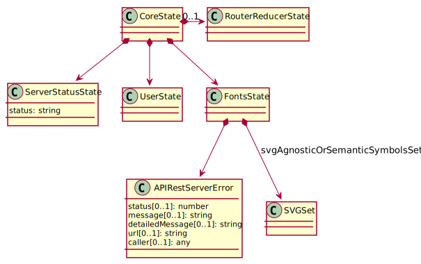

The ``APIRestServerError`` is used to record the last API rest call error reported by the different services.  

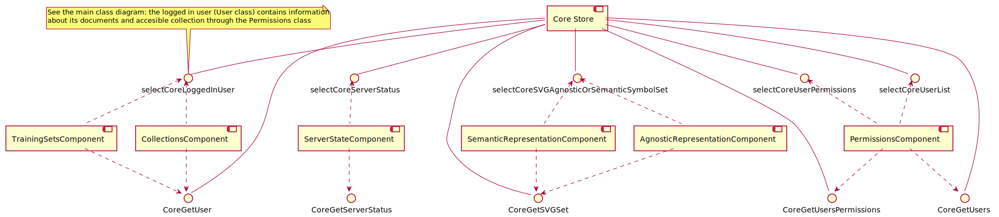

### User actions
Note this store just obtains data such as collections associated to the authenticated user through its user ID. For authentication, see the [Auth Store](#auth-store).

| ** Action** | **`UserService` method** | **API Rest method** | **`UserState` properties on succes** | **Properties on failure** | 
| --- | ----------- | ----------- | ----------- | ----- |
| `UserGetUser(userID: number)` | `getUserProjection$(userID: number)` | `/users/user/excerpt` | `loggedInUser: User` from [IUserProjection](spring.md#projections)  | 
| `UserGetUsersPermissions()` |`getUsersPermissions$()` | `/users/userPermissions` |  `permissionsData: any` | 
| `UserGetUsers()` | `getUsersPermissions$()` | `/users/allUsers` | `userList: any` | 
|  |  |  |  |  |

**TODO hacer tipo de dato para permissionsData y userList, que no sean string, any -- hacer también las proyecciones ** 

### Fonts actions 
| ** Action** | **`FontsService` method** | **API Rest method** |**`FontsState` properties on succes** | **Properties on failure** | 
| --- | ----------- | ----------- | ----------- | ----- |
| `CoreGetSVGSet(notationType: string, manuscriptType: string)` | `getSVGSet$(notationType: string, manuscriptType: string)` | `/fonts/svgset` | `svgAgnosticOrSemanticSymbolsSet` | `apiRestServerError`| 
|  |  |  |  |  |

### ServerStatus actions
| ** Action** | **`ServerStatusService` method** | **API Rest method** |**`FontsState` properties on succes** | **Properties on failure** | 
| --- | ----------- | ----------- | ----------- | ----- |
| `CoreGetServerStatus()` | `getServerStatus$()` | `/fonts/svgset` | `status: ((action.payload == "true") ? "ON" : "OFF")` | `| 
|  |  |  |  |  |

**TODO - mensaje con más información del servidor **

## LayoutComponent
This component is in charge of displaying the common information of the application: menu bar and status bar for logged in users.

The `RouterOutlet` renders the component selected by the active routing module, i.e., the active page.

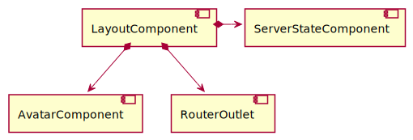

The `AvatarComponent` displays the current logged user information. 
`ServerStateComponent` shows server-side information state.

### Breadcrumbs store component
It only contains information about the breadcrumbs.

| **Action** | **`BreadcrumbsService` method** | **API Rest method** | **`BreadcrumbsState` properties on succes** | **Properties on failure** | 
| --- | ----------- | ----------- | ----------- | ----- | 
| `BreadcrumbsUpdateCollection(collectionID: number)` | `getCollectionBreadcrumbs$(collectionID)` | `/breadcrumbs/collection` | `breadcrumbs` | `serverError`| 
| `BreadcrumbsUpdateDocument(documentID: number)` | `getDocumentBreadcrumbs$(documentID)` | `/breadcrumbs/document` | `breadcrumbs` | `serverError`| 

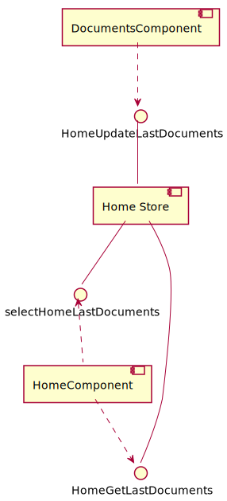

## auth.LogIn Component
As described in section [Routing and permissions](#routing-and-permissions), when a user tries to access any page and has not logged in yet, he/she is forwared to the `LoginComponent` by the `AuthGuard`.

## Features: Home
After the user logs in and the guard allows to enter as depicted above in diagram in [routing and permissions](#routing-and-permissions)), the following sequence is followed:
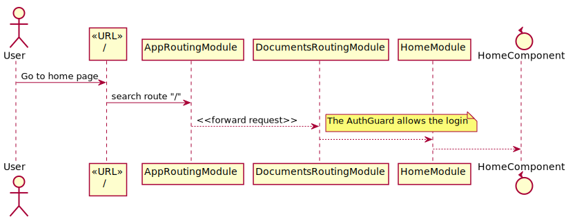

### Home store component
The last docuemnts are used to show the user the last documents opened by him/her. When a document is opened in the [Documents Component](#documents-component) this list is updated.

| **Action** | **`HomeService` method** | **API Rest method** | **`HomeState` properties on succes** | **Properties on failure** | 
| --- | ----------- | ----------- | ----------- | ----- | 
| `HomeGetLastDocuments(userID: number, count: number)` | `getUserLastDocuments$(userID: number, count: number)` | `/lastdocument/user` | `lastDocuments` | `errorMessage`| 
| `HomeUpdateLastDocuments(userID: number, documentID: number)` | `updateUserLastDocument$(userID: number, documentID: number)` | `/lastdocument/update` | `lastDocuments` | `errorMessage`| 

## Features: Documents
It shows the collections, subcollections and their documents.

### Documents store component

| **Action** | **`DocumentsService` method** | **API Rest method** | **`DocumentsState` properties on succes** | **Properties on failure** | 
| --- | ----------- | ----------- | ----------- | ----- | 
| `DocumentsGetCollection(collectionID: number)` | `getCollection$(collectionID: number)` | `/collections/collection/excerpt` | `collection` | `apiRestServerError`| 
| `DocumentsCreateSubcollection(parentID: number, name: string)` | `createSubcollection$(parentId: number, subcollectionName: string)` | `/collections/create` | `subcollections` | `apiRestServerError`| 
| `DocumentsDeleteSubcollection(id: number)` | `deleteSubcollection$(id: number)` | `/collections/delete` | `subcollections` | `apiRestServerError`| 
| `DocumentsMoveDocumentsToSubcollection(currentCollectionID: number, documentIDs: number[], subcollectionID: number)` | `moveDocumentsToSubcollection$(currentCollectionID: number, documentIDs: number[], subcollectionID: number)` | `/collections/moveDocumentToSubcollection` | `changedCollectionID` | `apiRestServerError`| 
| `DocumentsMoveDocumentsToNewSubcollection(currentCollectionID: number, documentIDs: number[], subCollectionName: string)` | `moveDocumentsToNewSubcollection$(currentCollectionID: number, documentIDs: number[], newCollectionName: string)` | `/collections/moveDocumentToNewSubcollection` | `changedCollectionID` | `apiRestServerError`| 

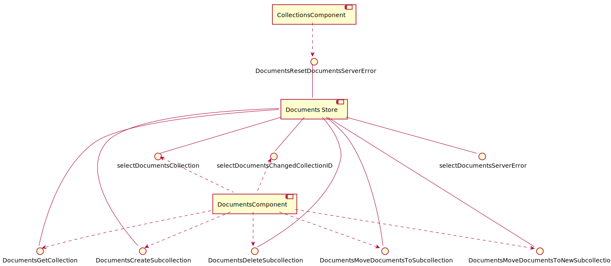

### features.documents.CollectionsComponent
It retrieves the collections the user has permissions to access using:
1. First the user ID through the [Auth Store](#auth-store)
2. Then the [Core store](#core-store).

### features.documents.DocumentsComponent
It shows both subcollections and leaf documents.

**TO-DO StateComponent**

### Document store component
It shows the opened document.

| **Action** | **`DocumentService` method** | **API Rest method** | **`DocumentState` properties on succes** | **Properties on failure** | 
| --- | ----------- | ----------- | ----------- | ----- | 
| `DocumentGetOverview(documentID: number)` | `getOverview$(documentID: number)` | `/documents/<documentID>?projection=overview` | `documentOverview` (containing images unassigned to sections), parts, sections (including images)  | `apiRestServerError`| 
| `DocumentMoveImagesToSection(imageIDs: number[], sectionID: number)` | `moveImagesToSection$(imageIDs: number[], sectionID: number)` | `/documents/moveToSection` | `documentOverview` (with images moved from secetion)  | `apiRestServerError`| 
| `DocumentNewSection(documentID: number, name: string)` | `createSection$(documentID: number, name: string)` | `/documents/createSection` | `documentOverview` (with new section)  | `apiRestServerError`| 
| `DocumentRenameSection(section: Section)` | `renameSection$(section: Section)` | `/documents/renameSection` | `documentOverview` (with section changed)  | `apiRestServerError`| 
| `DocumentDeleteSection(sectionID: number)` | `deleteSection$(sectionID: number)` | `/documents/deleteSection` | `documentOverview` (with section deleted and images moved)  | `apiRestServerError`| 

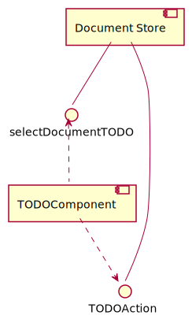

-----
**TODO ¿Unificar apiRestServerError en un sólo Store?**

----
** Documentar Librerías**
https://www.npmjs.com/package/klona
para deep-copy objetos en reducer de ngrx

https://www.npmjs.com/package/ngx-contextmenu
Context menus