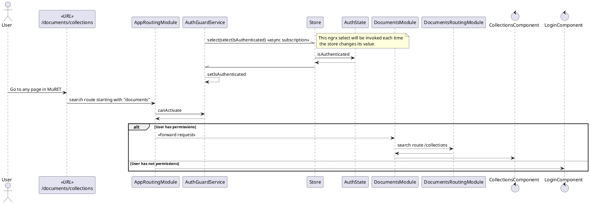
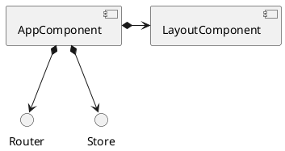
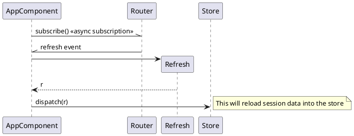
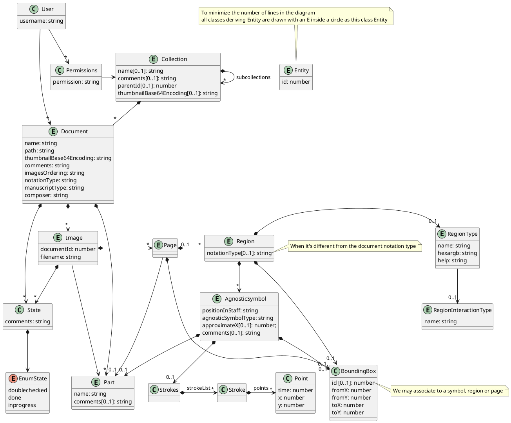
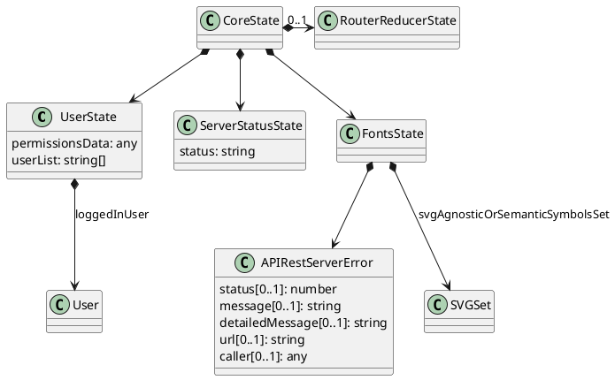
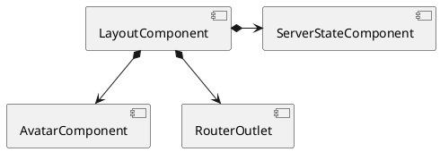
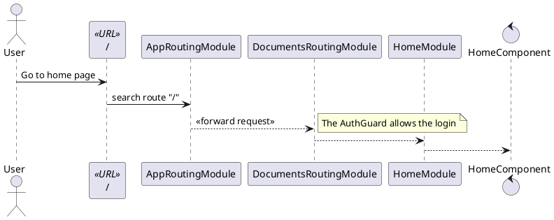

#MuRET technical documentation
*NOTE: see diagram below see the [semantics of some UML diagram element styles used](uml_style.md).*

The front end has been developed using **Angular** with **Redux**. The following diagrams depict the interaction between components and [how the *ngrx store* is managed](../angular/redux.md).

## Routing and permissions
The routing mechanism has been used. All elements are grouped into components, each one with its own routing.
Guards are used to prevent unauthorized users from entering restricted pages.

## Main AppComponent
The main angular component just takes care of notifying the store when the page has been refreshed to reload session data as a means of not loosing the state of the application.
Everything else is delegated to the `LayoutComponent`.

## Model
The following class diagram contains the whole hierarchy, however it's not always fully populated, it depends on the different actions in individual modules.

## CoreState
This *Redux* class contains information used along the whole application. 

**TODO Decir qué se rellena de la jerarquía en cada llamada**

## LayoutComponent
This component is in charge of displaying the common information of the application: menu bar and status bar.  
The `RouterOutlet` renders the component selected by the active routing module, i.e., the active page.

The `AvatarComponent` displays the current logged user information. 
`ServerStateComponent` shows server-side information state.

## Home page
After the user logs in and the guard allows to enter as depicted above in diagram in [routing and permissions](#routing-and-permissions)), the following sequence is followed:

