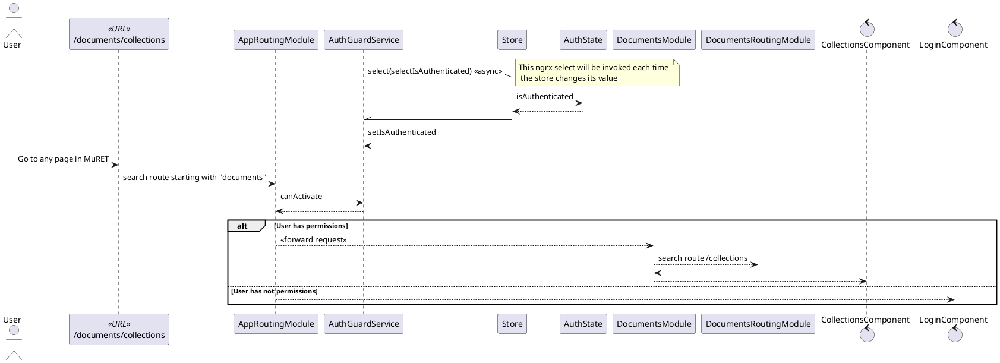

#MuRET technical documentation
*NOTE: see diagram below see the [semantics of some UML diagram element styles used](uml_style.md).*

The front end has been developed using **Angular** with **Redux**. The following diagrams depict the interaction between components and [how the *ngrx store* is managed](../angular/redux.md).
The routing mechanism has been used. All elements are grouped into components, each one with its own routing. 
Guards are used to prevent unauthorized users from entering restricted pages. 

