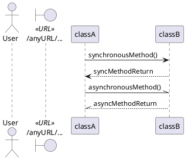

```puml
@startuml
actor User
boundary "/anyURL/..." as url <<URL>>
classA -> classB: synchronousMethod()
return syncMethodReturn
classA -\\ classB: asynchronousMethod()
return asyncMethodReturn
@enduml
```
